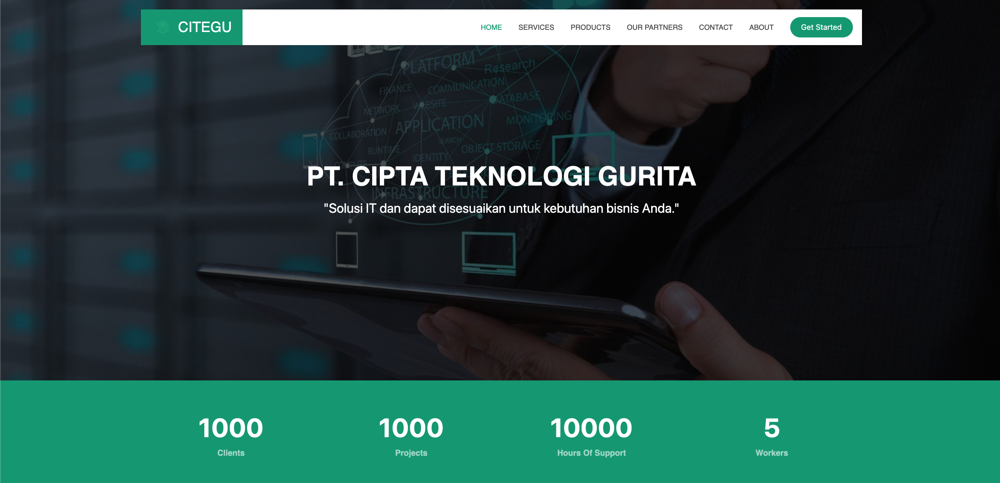

<p align="center">
  
</p>

<h1 align="center">Website-Citegu</h1>

<p align="center">
  <b>Website yang baru di buat</b>
</p>

---

## 📸 Screenshots

### Home

<p align="center">
  
</p>
---

## ⚙️ Getting Started

## Persyaratan Sistem

Pastikan Anda memiliki hal-hal berikut terinstal di sistem Anda:

* **PHP** (disarankan versi 8.x atau lebih tinggi)
* **Composer** (Pengelola dependensi PHP)
* **MySQL** (atau database lain yang didukung Laravel)
* **Node.js & NPM/Yarn** (untuk kompilasi aset frontend)
* **Web Server** (Apache atau Nginx, atau menggunakan `php artisan serve`)

---

## Panduan Instalasi

Ikuti langkah-langkah di bawah ini untuk menjalankan proyek secara lokal:

1.  **Clone Repositori:**
    ```bash
    git clone [https://github.com/NamaUserAnda/NamaRepoAnda.git](https://github.com/NamaUserAnda/NamaRepoAnda.git)
    cd NamaRepoAnda
    ```

2.  **Instal Dependensi Composer:**
    ```bash
    composer install
    ```

3.  **Salin File `.env`:**
    ```bash
    cp .env.example .env
    ```
    Kemudian, buka file `.env` yang baru disalin dan sesuaikan konfigurasi database dan email (lihat bagian **Konfigurasi Lingkungan**).

4.  **Buat Kunci Aplikasi:**
    ```bash
    php artisan key:generate
    ```

5.  **Konfigurasi Database:**
    Buka `phpMyAdmin` atau klien database Anda, buat database baru (misalnya `db_citegu` sesuai `.env` Anda).
    Jalankan migrasi database:
    ```bash
    php artisan migrate
    ```
    Jika Anda memiliki seeder, jalankan juga:
    ```bash
    php artisan db:seed
    ```

6.  **Instal Dependensi NPM dan Kompilasi Aset Frontend:**
    ```bash
    npm install
    npm run dev # Untuk pengembangan
    # atau
    npm run build # Untuk produksi
    ```

7.  **Jalankan Server Lokal:**
    ```bash
    php artisan serve
    ```
    Aplikasi akan tersedia di `http://127.0.0.1:8000` (atau port lain yang ditunjukkan).

---

## Konfigurasi Lingkungan (`.env`)

Setelah menyalin `.env.example` ke `.env`, Anda **wajib** mengedit file `.env` untuk menyesuaikan detail berikut:

* **Database:**
    ```dotenv
    DB_DATABASE=db_citegu
    DB_USERNAME=root
    DB_PASSWORD=
    ```
    Sesuaikan dengan kredensial database lokal Anda.

## Kontak

Jika Anda memiliki pertanyaan atau saran, jangan ragu untuk menghubungi:

* **Nama Anda / Perusahaan Anda**
* Email: youremail@example.com
* Website: yourwebsite.com

---
<p align="center"> <br> <b>Built with Laravel, and etc</b> </p>


